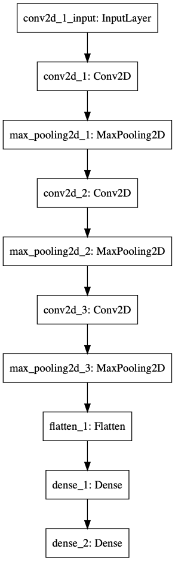

# Convolutional Neural Network - MNIST Digits dataset
Python 3 and Keras

## RUN
Go to your file directory, and run this command :
```bash
python3 main.py
```
By default it just apply the model, if you want to train it again
uncomment the function ```build_model()```

## Data
-Load for MNIST
-Data volume : 60000
-Input shape is 28x28x1 (Gray Scale Image)

## Architecture


## Hyperparameters

loss='categorical_crossentropy'
optimizer=Adadelta()
batch_size=200
epochs=2
